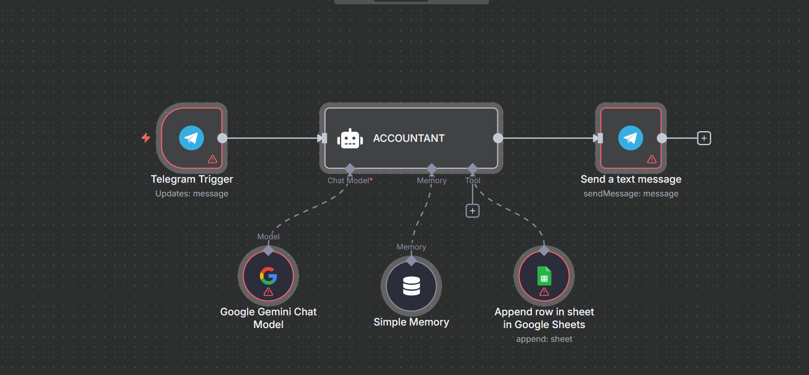

# 📊 Accountant AI Agent 🤖

Welcome to my **very first AI-powered automation project** — built proudly using the **n8n** workflow automation tool!  
This project introduces **"AccounTAI"**, a conversational accountant agent that interacts with users on **Telegram**, understands their financial queries via **Google Gemini (PaLM)**, remembers context, and stores data in **Google Sheets**.

> 🚀 I'm super excited to share this milestone. This is my **first-ever AI agent**, and it's just the beginning!

---

## 📸 Visual Flow of n8n Workflow

> Here's how the automation logic flows behind the scenes in n8n:

---

## 💡 What is this project?

This is a **chat-based AI accountant assistant** that:
- Talks to users via Telegram
- Understands messages using **Google Gemini (PaLM)**
- Retains conversation context with memory
- Replies responsibly with clear accounting explanations
- Stores structured data in **Google Sheets** for tracking and analysis

All of this is orchestrated in **n8n** — a no-code/low-code automation platform that empowers creators like me to build powerful agents without writing boilerplate code!

---

## 🛠️ Features

- 💬 Telegram Bot as user interface  
- 🧠 Google Gemini LLM for smart conversation  
- 📝 Contextual memory with buffer window  
- 📊 Google Sheets integration to log user inputs  
- 👨‍🏫 Personalized AI persona that explains accounting concepts  
- 🛡️ Built-in disclaimer and ethical boundaries  

---

## 🧪 Components Used (n8n Nodes)

| Node | Purpose |
|------|---------|
| **Telegram Trigger** | Starts workflow on new Telegram message |
| **Google Gemini Chat Model** | Processes user message with LLM |
| **Langchain Memory Buffer** | Remembers chat context |
| **Custom Prompt Agent** | Persona-based financial assistant |
| **Google Sheets Tool** | Appends data to your financial sheet |
| **Send Telegram Message** | Replies back to user with insights |

---

## 🚀 How to Use

### 🧰 Prerequisites

1. **n8n** instance (self-hosted or cloud)  
2. A **Telegram bot token** and chat ID  
3. **Google Gemini API key** (PaLM)  
4. A **Google Sheet** (and credentials)  
5. Basic familiarity with n8n workflows  

---

### ⚙️ Setup Instructions

1. **Import the JSON file** into your n8n instance  
    - Go to **Workflows → Import**  
    - Upload `accountant ai agent.json`  

2. **Configure Credentials**
    - Set up credentials for:
      - Google Gemini (PaLM)
      - Google Sheets
      - Telegram

3. **Update the following:**
    - Your **Google Sheet ID** and **Sheet Name**
    - **Telegram Chat ID** in the `Send Message` node (already dynamic)

4. **Activate the workflow**
    - Turn the toggle ON in the top right

5. **Chat with your bot**
    - Send a message on Telegram
    - The bot will reply with AI-generated accounting insights and store entries in your sheet

---

## 🔐 Safety Disclaimer (used by the AI)

> _"I am an AI assistant designed for accounting tasks. Please remember that this information is for educational purposes only and should **not** be considered financial, tax, or legal advice. Always consult with a qualified professional for personalized guidance."_

---

## 🌟 My First AI Agent with n8n!

This is more than just a project — it's a celebration of how accessible AI automation has become. Thanks to **n8n**, I built a fully functional AI agent that:
- Engages users
- Applies domain-specific knowledge
- Works across platforms

> 💬 Want to create your own AI-powered assistant with n8n? Just do it — it's incredibly fun and powerful.

---

## 📎 File

- `accountant ai agent.json`: The complete n8n workflow file (import this in your n8n dashboard)

---

## 🧠 What's Next?

I plan to:
- Add **voice-to-text integration**
- Enable **CSV download** of financial logs
- Connect with **email reminders** or **calendar alerts**

Stay tuned, and feel free to fork the project!

---

## 🏷️ Tags

`#AIagent` `#n8n` `#GoogleGemini` `#TelegramBot` `#GoogleSheets` `#AccountantBot` `#MyFirstAIAgentProject`

---

## 📫 Connect with Me

- 🔗 [LinkedIn](https://www.linkedin.com/in/nsprakashreddy/)
- 🐙 [GitHub](https://github.com/Suryareddy180)

Let’s connect and build something amazing together!
